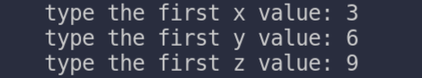
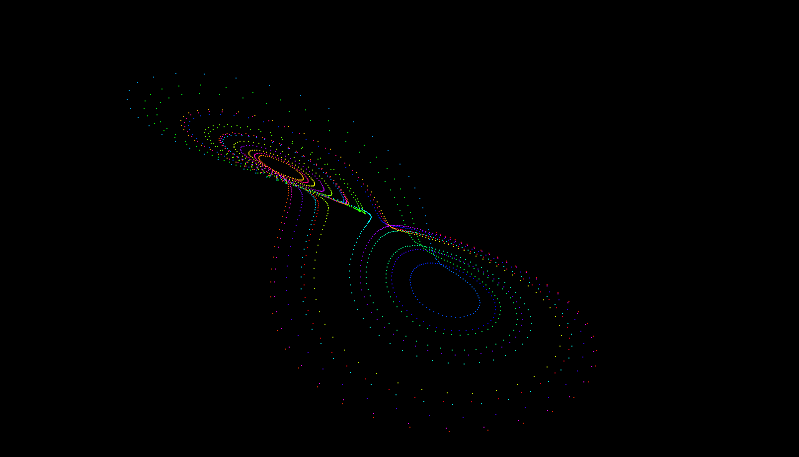
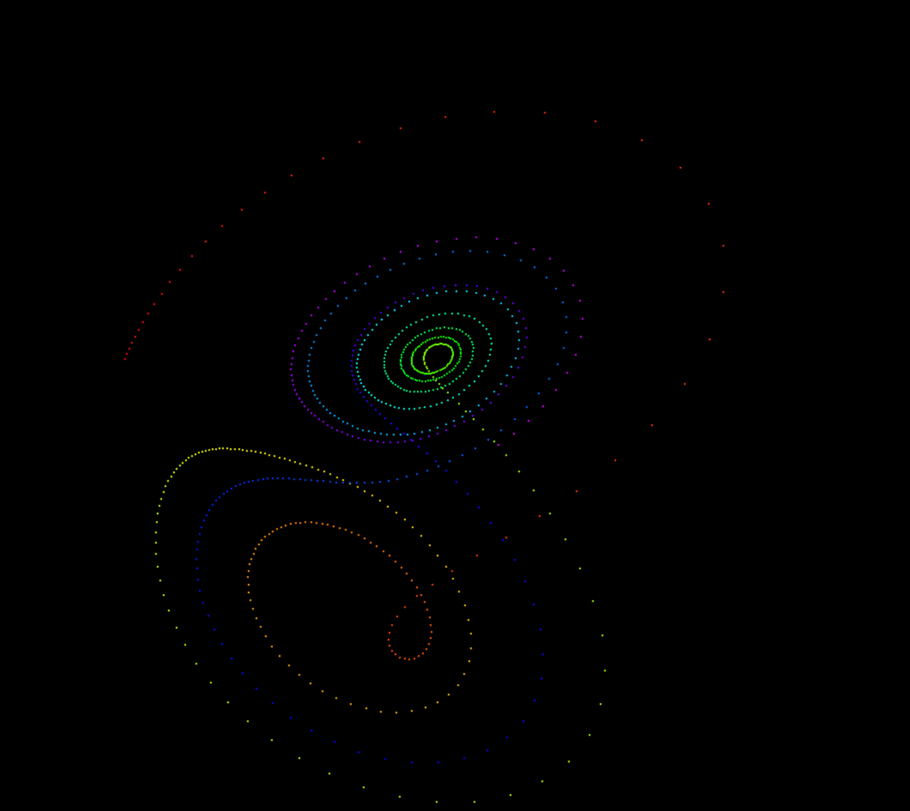
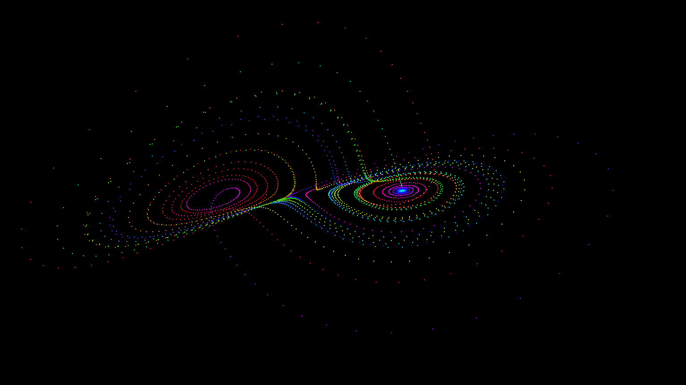
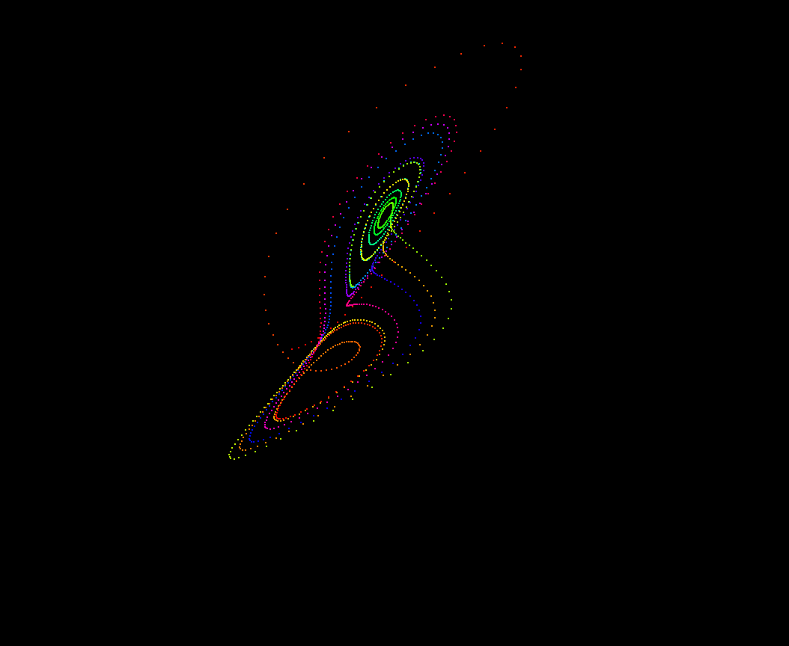
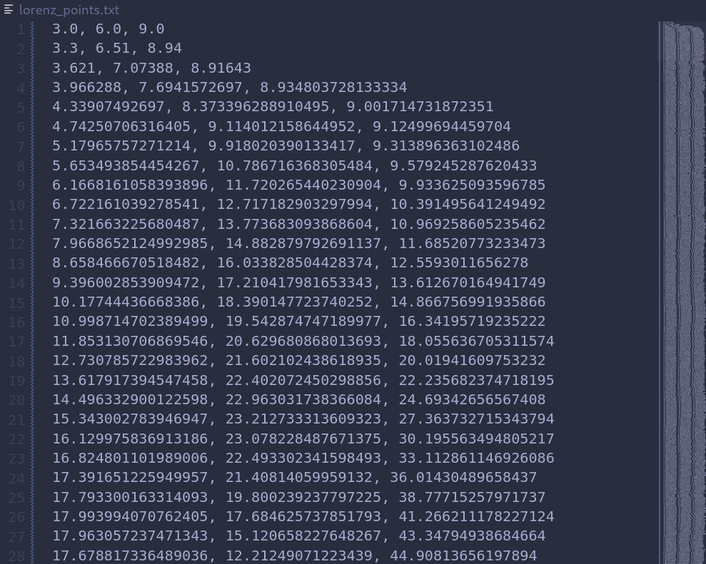

# Chaos

## Overview

This project simulates a classic example of chaotic behavior in a dynamic system through the Edward Lorenz's equations (1963). 
The Lorenz model is governed by a set of three nonlinear differential equations:

    dx/dt = σ(y - x)
    dy/dt = x(ρ - z) - y
    dz/dt = xy - βz

These equations describe the **evolution** of three variables, x, y, and z, over time. 
The parameters σ, ρ, and β determine the system's behavior and can lead to fascinating and complex trajectories.

## The nature of Lorenz equations

The above equations exhibit sensitive dependence on initial conditions, a characteristic of chaotic systems. Small changes in the initial values of **x**, **y**, and **z** or in the parameters **σ**, **ρ**, and **β** can result in significantly different trajectories. 
This is often referred to as the "butterfly effect", where a minor perturbation can lead to vastly different outcomes.

The parameters have the following effects:

- σ (sigma): controls the **rate of interaction** between **x** and **y** variables. Higher values lead to more rapid changes.

- ρ (rho): Determines the nature of the system's attractor, influencing whether it exhibits **chaotic** behavior or converges to **stable** fixed points.

- β (beta): Shapes the attractor's structure, with different values resulting in distinct **patterns**.

The Lorenz equations, originally devised for atmospheric convection modeling, find applications in meteorology, fluid dynamics, chaos theory, engineering, art, and, in specific cases, modeling complex economic systems.
Exploring different parameter values and initial conditions can reveal a wide range of **beautiful and complex patterns**, highlighting the inherent **unpredictability** and richness of chaotic systems.

> **PS:** You may have noticed that the code is extensively commented. This is for study purposes; It's the way I learn, and I could have easily deleted it, but I believe that it can guide someone, even if just a single commented line is helpful to that one, for me it's worth it.

# Dependencies

Need to have the following dependencies installed:

- Python
- Pygame
- PyOpenGL
- Pandas

Install the required packages using pip:

    pip install pygame PyOpenGL pandas

# Follow

## set the coordinates

## choose viewing mode

## watch

## save the progress for later analysis

